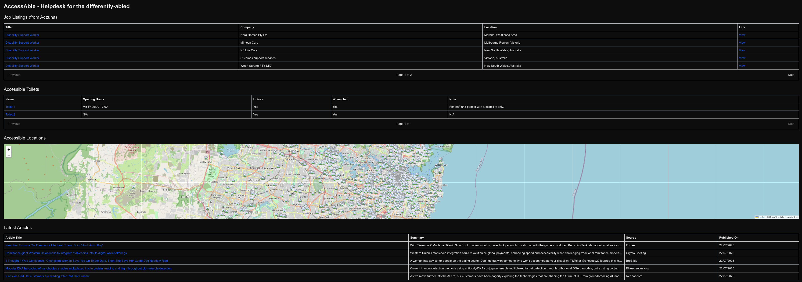

# ♿ AccessAble | For the Differently-Abled



A plug-and-play accessibility dashboard that helps users discover:
- ✅ Disability-inclusive job listings
- ✅ Accessible locations and toilets
- ✅ Latest news & articles around accessibility


[](https://differently-abled-helpdesk.vercel.app)

🔗 **Live Site**: [https://differently-abled-helpdesk.vercel.app](https://differently-abled-helpdesk.vercel.app)

> ⚠️ If the above link is not live ❌, the app might be asleep. Message me on [LinkedIn](https://www.linkedin.com/in/anmoldeora) and I’ll wake it up!

---

## 🧩 Public APIs used

- **Accessible Locations** via OpenStreetMap Overpass API
- **Public Toilets** for wheelchair users
- **Job Listings** from Adzuna
- **Latest News** powered by NewsAPI

---

## ⚙️ Tech Stack

- ⚡ Next.js 15 (App Router)
- 🛠 TypeScript (v5)
- 🎨 Tailwind CSS
- 🌍 Overpass API, Adzuna API, NewsAPI
- 🚀 Hosted on Vercel
- Node (requires anything above v18, to align with Next.js)
- SSR React components

---

## 📁 Folder Structure
```plaintext
src/
├── components/        # UI blocks
├── lib/apis/          # API integrations
├── app/               # Next.js App Router pages/routes
└── styles/            # Tailwind & global styles
```

## 🧪 Running Locally

```bash
git clone https://github.com/deoraanmol/differently-abled-helpdesk.git
cd differently-abled-helpdesk
cp .env.example .env.local # Add your API keys
npm install
npm run dev
```

Open [http://localhost:3000](http://localhost:3000) with your browser to see the result.

You can start editing the page by modifying `app/page.tsx`. The page auto-updates as you edit the file.

This project uses [`next/font`](https://nextjs.org/docs/app/building-your-application/optimizing/fonts) to automatically optimize and load [Geist](https://vercel.com/font), a new font family for Vercel.

## Helpful Links
- [Next.js Docs](https://nextjs.org/docs)
- [Next.js deployment docs](https://nextjs.org/docs/app/building-your-application/deploying)

You can check out [the Next.js GitHub repository](https://github.com/vercel/next.js) - your feedback and contributions are welcome!

## Deploy on Vercel

Use the [Vercel Platform](https://vercel.com/new?utm_medium=default-template&filter=next.js&utm_source=create-next-app&utm_campaign=create-next-app-readme) to deploy, probably the easiest way.
